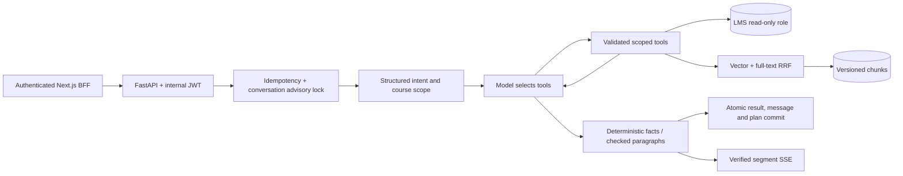

# Architecture, Threat Model and Decisions

## Data flow

## Trust boundaries

Identity is the signed JWT subject, never a model parameter or browser body field.
The router is not an authorization mechanism. Repositories and both retrieval branches
filter ownership before returning records. Runtime SQL privileges deny LMS writes.
Teacher indexing verifies course ownership; source viewing checks current enrollment,
active document version and the file hash.

User text, conversation history and PDF content are untrusted. No SQL execution tool or
general filesystem/network tool is exposed. The paragraph parser accepts only known
source IDs and does not accept model-generated source hyperlinks or HTML.

Remaining risks: a router can misclassify user intent; citation existence does not prove
entailment; retrieved malicious text can influence wording; repository filtering is not
database row-level security. The runtime role can read LMS tables, so SQL injection or
compromise of the service itself is outside what the JWT boundary can contain.

## ADR 1: bounded model-driven ReAct (supersedes deterministic dispatch)

A typed policy determines scope and plan-write intent, not the tool sequence. The model
chooses from four tools and receives their actual observations before choosing another
action or an answer. Independent reads use separate sessions and run concurrently.
Four rounds and eight calls bound the loop. Model-authored plans remain staged until
the final transaction. This costs more model calls than the historical dispatcher but
supports evidence-dependent follow-up actions. Thinking is internal, not a security boundary.
The model supplies one-based plan day indices. The service turns them into dates from
its current local date and checks every requested day, daily minutes, course scope and
observed evidence before staging. See [the ReAct upgrade](react-upgrade.md) for provider
settings, exact plan rules and evaluation status.

## ADR 2: hybrid retrieval and version publication

Vector cosine and PostgreSQL English full-text retrieve at most 20 candidates each.
RRF with k=60 merges ranks and returns at most six chunks. Permission filtering is inside
each branch. Vector-only is a selectable ablation, not a second service.

File SHA-256 skips unchanged documents. Changed files are normalized per page and chunk.
Embedding reuse requires matching text, model revision and chunker version. A document
advisory transaction lock serializes indexing. New chunks and active-version metadata
replace the old state atomically; an embedding failure leaves the previous publication intact.
Historical versions are not retained: an old source link returns not-found after replacement.

## ADR 3: verified segments and durable writes

LMS numerical facts are rendered from fixed query output. PDF paragraphs must name current,
authorized source IDs whose excerpts occur in the indexed chunks. Invalid paragraphs are
never sent. The complete draft is validated before paragraphs are emitted. One repair
is allowed; persistent validation failure clears pending plans and returns a conservative answer.

SSE token events therefore measure first validated text, not provider TTFT.
General conversation is buffered before display and is not described as grounded in LMS data.
All staged plans, final JSON and the assistant message commit in one database transaction.
Cancellation discards drafts. Idempotency replays final JSON only, never reruns mutations.
Partial streams are not persisted as completed assistant messages after a transport failure.

## Failure review

The historical report combines lexical fact checks, source matching and authorization
assertions. Its reported authorization leak count also included non-leak policy failures.
Use it as exploratory history, not a clean scorecard for the new implementation.
The previous late verifier could replace a final answer after a draft had already streamed.
The regression test now injects an unknown source into a real graph and asserts that the
unverified draft is absent from every user-visible event.

## Observability

Model calls and reported token usage are counted separately from tool invocations.
Route/tools/answer-and-verify histograms and explicit node spans expose the critical path.
Trace metadata excludes user IDs, cookies, prompts and PDF bodies. Runtime failures log
their type and trace ID; API errors do not expose provider payloads.
