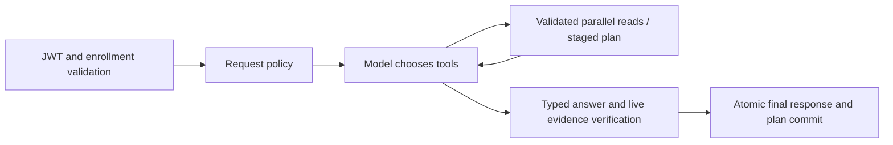

# Model-driven ReAct upgrade

## Execution and boundaries

The policy classifier does not schedule tools. Four model-visible tools replace the
old six-tool dispatch: `get_learning_snapshot`, `search_course_materials`,
`get_active_study_plan`, and `stage_study_plan`. Legacy read wrappers remain private
implementation helpers. Every course argument is checked against the selected scope
and authenticated enrollment. User identity cannot be supplied as a tool argument.

Snapshot sections run concurrently with independent repository sessions. Read calls
are memoized within a run, including concurrent duplicate calls. Writes are serial,
require explicit plan intent and completed snapshot sections, and only stage data.
The existing completion transaction persists the final answer and plan together.
Cancellation and failure discard pending plans. No failed execution is replayed.

The loop allows four tool rounds and eight total calls, followed by a tool-free final
answer. One schema/evidence repair is allowed. Model reasoning is run-local; graph
checkpoints contain only stripped tool calls, observations and validated answers.
The frontend receives actual tool status and validated paragraphs, never thinking.
Partial snapshot failures preserve the successful sections and mark the missing section.

## Plan dates and evidence

The model supplies `day_index`, not a calendar date. The service maps day 1 to its
current local date, day 2 to the following date, and so on. A requested horizon is
between 3 and 14 days; the model must include at least one task for every day and use
the exact requested horizon. Each task lasts 10-240 minutes, and the total for any day
cannot exceed 240 minutes. The plan contains at most three tasks per day on average
(`3 * horizon_days` total).

Every task has an action, duration, priority, reason and observed evidence IDs. A
course-scoped plan rejects evidence from another course. The model cannot stage a plan
until profile, assessments and deadlines have all been read successfully. The service
converts day indices to dates and validates all tasks before staging; the final answer
and plan commit together only after answer verification. Quantitative record facts in
responses come from backend evidence, while model prose supplies qualitative advice.
Validation of references does not prove that every recommendation is pedagogically sound.

## Model settings

Use `LLM_PROVIDER=ollama`, `LLM_MODEL=qwen3:8b`, `LLM_DISABLE_THINKING=false`,
`LLM_CONTEXT_SIZE=8192`, `LLM_MAX_TOKENS=4096`, `LLM_TIMEOUT_SECONDS=120`,
and `RUN_TIMEOUT_SECONDS=360`. Existing `.env` overrides must be updated explicitly.
`LLM_BASE_URL` may retain its `/v1` suffix; the native adapter removes it.
The OpenAI-compatible adapter is selected with `LLM_PROVIDER=openai_compatible`;
Ollama reasoning parameters are not sent to other providers.

At startup a synthetic probe requires a real tool call, use of the returned value,
and an Ollama reasoning field when thinking is enabled. Failure prevents startup;
the container health check allows time for the probe. `LLM_STARTUP_PROBE=false` is
only intended for controlled-model tests, not to claim provider compatibility.

## Evaluation status

The historical 330-case results measure the previous deterministic dispatcher, not
this implementation. Do not reuse those numbers as ReAct results.

Candidate generation selects five variants from each original template using a fixed
SHA-256 ordering and adds 30 new scenarios: tool feedback, parallel records, synthesis,
plans, security and recovery (five each). It records selected IDs, before/after label
audit and a dataset hash. Development variants and old reports remain untouched. The
new cases are pending human review and the 180 candidates have not been run or frozen.
Five recovery cases use the isolated evaluation-only fault harness; the production API
does not expose fault injection.

Routing now accepts equivalent tool trajectories and checks completed capabilities.
HTTP refusals can satisfy explicitly tagged authorization cases. Citation and fact
assertions are not weakened to compensate for model errors.

Development diagnostics against `coursepilot_upgrade_test` retain failed attempts and
public drafts, but never raw thinking. The latest three-prompt real-model smoke returned
three answers and staged a plan in the plan scenario. These prompts are not a quality
benchmark; advice quality still needs review.

## Remaining acceptance work

Human review and freezing of the candidate labels, a full 180-case execution and a
new performance report remain open. Controlled recovery scenarios have a guarded
evaluation harness and unit coverage, but have not been run as a real-model HTTP
evaluation. Source-ID validity does not prove semantic entailment, and prose advice
still requires human quality assessment.
